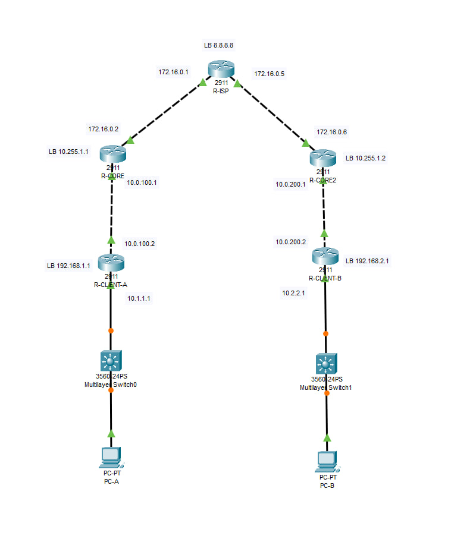

# OSPFv3-BGP-IPv6-lab
Practical laboratory work on networks: multi-area OSPF, BGP, eBGP, IPv6

This lab demonstrates advanced network configuration using **OSPF(multi-area), BGP and IPv6**. All configurations were performed in Ciscp Packet Tracer, and the topology simulates a multi-AS network with provider and client routers.

## Technologies

- Routing Protocols: OSPFv2, OSPFv3, BGP
- IPv4 & IPv6 addressing
- Multi-area OSPF
- Inter-AS BGP routing

## Lab Topology

### OSPF + BGP + IPv6 Network Diagram

The topology includes:  
- Provider network (AS 65000)  
- Two core routers (AS 65001, AS 65002)  
- Two client networks (AS 65100, AS 65200)  
- IPv4 and IPv6 addressing on all links  
